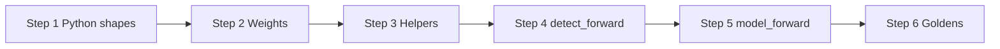

# Detect head (Ultralytics) — implementation plan

> **Purpose:** Step-by-step roadmap to implement the YOLO26 `Detect` module in C to match Ultralytics. **When:** Before or while wiring `model_forward`, exporting head weights, or adding parity tests.

## Scope and assumptions

- **YAML:** `[[16, 19, 22], 1, Detect, [nc]]` on P3/P4/P5 feature maps ([yolo26.yaml](yolo26.yaml) line 52).
- **`reg_max: 1`** — no DFL; box branch is **4 channels per location** (not `4 * reg_max` with softmax).
- **`end2end: True`** — at **inference**, use the **one-to-one** head (`one2one` / `cv4` path in Ultralytics), not the many-to-one training heads only.
- **Output contract:** C already expects **`decode_detections`** input as **`[1, max_det, 6, 1]`** NCHW — `x1,y1,x2,y2` (pixels), `score`, `class` — i.e. the tensor after **`Detect.postprocess()`** ([include/detection.h](include/detection.h)).

Reference implementation: Ultralytics `ultralytics/nn/modules/head.py` (`Detect` class, `inference`, `postprocess`, `make_anchors`, `dist2bbox`).

---

## Step 1 — Freeze the Python reference

1. Open **`head.py`** and trace **`Detect.forward`** for **`self.end2end`** and **`self.training == False`** (export/inference path).
2. Note **exact** tensor shapes after:
   - per-scale **`cv2`** (box) and **`cv3`** (cls) — or **`one2one`** substitutes when `end2end` is on;
   - **concat** across scales;
   - **`make_anchors`** / strides;
   - **`dist2bbox`** (or `bbox_decode`) — **xyxy in pixel space** for input image size;
   - **sigmoid** on class logits;
   - **`postprocess`** (top-`k`, `max_det`) → **`[..., 6]`**.
3. Record **`max_det`**, **`nc`**, and **strides** `[8, 16, 32]` for P3/P4/P5 at 640×640.

**Done when:** You have a shape table (per tensor) you can paste into Step 5 as the golden spec.

---

## Step 2 — Weight inventory and naming

1. List all **Conv** (fused) parameters the head needs: per-scale **`cv2`**, **`cv3`**, and **`end2end`** **`one2one`** (or equivalent) weights/biases as exported in your `.pt`.
2. Extend **[tools/converter.py](tools/converter.py)** (or document manual steps) so **`yolo26.bin`** contains every tensor **`model.<idx>.…`** needed by the C forward, in the same order PyTorch uses.
3. Confirm **BN is fused** into conv weights using the same math as **[src/utils.c](src/utils.c)** / existing layer tests.

**Done when:** `model_get_weight` can resolve every tensor required for one full `Detect` inference pass.

---

## Step 3 — Math helpers (shared, testable)

Implement small **pure** functions (e.g. in **`src/layers.c`** or **`src/detection.c`**) with headers in **`include/layers.h`** / **`detection.h`** as appropriate:

| Piece | Role |
| :--- | :--- |
| **`make_anchors`** | Grid cell centers + stride per feature map (match Ultralytics `make_anchors`). |
| **`dist2bbox`** / **`bbox_decode`** | Distance predictions → **xyxy** (or xywh then convert); must match **`dist2bbox`** + image shape. |
| **Sigmoid** | On class logits before `postprocess`. |
| **`postprocess` (top-k)** | Mirror **`Detect.get_topk_index`** + gather boxes + **`torch.cat([boxes, scores, conf], dim=-1)`** semantics. |

**Done when:** Each helper has a **unit test** or **golden** vs PyTorch on fixed small tensors (see Step 6).

---

## Step 4 — `detect_forward` API

1. Define **`detect_forward(...)`** inputs: three **`tensor_t`** feature maps (P3, P4, P5) + **`model_t`** (or explicit weight pointers) + **`tensor_t* out_postprocess`** shaped **`[1, max_det, 6, 1]`**.
2. Implement the **full** inference path (no shortcut): **one2one** convs → decode → concat scales → **anchors** → **dist2bbox** → **sigmoid** → **postprocess**.
3. Do **not** reintroduce a legacy **`[1, K, 4+nc]`** layout; the only consumer for boxes+scores in-app remains **`decode_detections`**.

**Done when:** For fused weights, **`out_postprocess`** matches **`model.detect` output** from PyTorch on the same three inputs (within float tolerance).

---

## Step 5 — Buffer and `model_forward` wiring

1. Map **intermediate** head tensors (per-scale logits, merged preds) to **`model_t->buffers`** or dedicated scratch (may need **more than one** buffer beyond current index `23`).
2. Implement **`model_forward`** in **[src/model.c](src/model.c)** so the neck outputs **feed `detect_forward`**, and the **last** tensor written is **`[1, max_det, 6]`** into the buffer consumed by **`decode_detections`**.
3. Update **`main.c`** (or bench) to run **real** inference instead of dummy head data once weights are loaded.

**Done when:** End-to-end: **RGB → preprocess → `model_forward` → `decode_detections`** runs without dummy tensors.

---

## Step 6 — Goldens and regression

1. Extend **[tools/generate_layer_tests.py](tools/generate_layer_tests.py)** to build a **minimal** PyTorch module: **Detect** only (or full model slice) with **fixed** P3/P4/P5 inputs, run **inference**, save **`postprocess`** output + optional intermediates to **`tests/data/detect_*.bin`**.
2. Add **`test_detect_*`** in **[tests/test_core.c](tests/test_core.c)** (or a dedicated test file): load bin, **`detect_forward`**, **`max_abs_diff`** vs golden.
3. **`make verify`** includes the new test.

**Done when:** CI/local **`make verify`** catches regressions in the head.

---

## Step 7 — Integration checklist

- [ ] Strides and grid sizes match **input_h × input_w** (not only 640×640 if model becomes dynamic later).
- [ ] **`num_classes`** in **`model_t`** matches **`nc`** from yaml / weights.
- [ ] **Score threshold** in **`decode_detections`** is applied **after** postprocess (already the contract).
- [ ] Document any **letterbox** mapping if original image size ≠ model input (out of scope for raw `Detect`; belongs in preprocess/display).

---

## Quick dependency order

Implement **Steps 1→3** in parallel with converter work; **Step 4** blocks **Step 5**; **Step 6** validates **Steps 3–5**.

---

**Final wiring (backbone + neck + `model_forward` + bench):** see [plan_wire.md](plan_wire.md).
