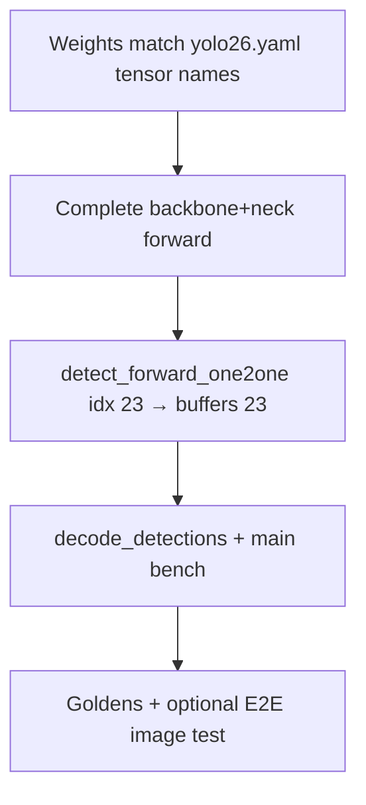

# End-to-end wiring — final integration plan

> **Purpose:** Ordered checklist to connect backbone → neck → `detect_forward_one2one` → `decode_detections` and bench. **When:** After layer parity is acceptable and Detect weights load; use this to finish `model_forward` and validate full inference.

---

## 1. Detect module index (fixed for this project)

For **[yolo26.yaml](yolo26.yaml)** as wired in `model_forward`, the **Detect** module is the last sequential block: **`YOLO26_DETECT_IDX` = `23`** in [include/model.h](include/model.h) (`model.23.one2one_cv2…`). No runtime config — if you change the YAML/graph or export, update the code and weights together.

---

## 2. Buffer map (fixed input size e.g. 640×640)

| Buffer | Role (matches [yolo26.yaml](yolo26.yaml) intent) |
| :--- | :--- |
| 0–1 | P1/2, P2/4 conv |
| 2–4 | C3k2 → P3/8 backbone |
| 5–6 | P4/16 |
| 7–10 | P5/32, SPPF, C2PSA |
| 11–13 | Upsample → concat P4 → C3k2 |
| 14–16 | Upsample → concat P3 → **P3 out** |
| 17–19 | Down → concat P4 → **P4 out** |
| 20–22 | Down → concat P5 → **P5 out** |
| **23** | **`[1, max_det, 6]`** postprocessed detections → **`decode_detections`** |

**Detect inputs:** P3 = `buffers[16]`, P4 = `buffers[19]`, P5 = `buffers[22]` (channels 64 / 128 / 256 at `n` scale — already match head allocation).

---

## 3. Implement `model_forward` in order

1. **Backbone (0 → 10):** For each YAML block, call the matching C op (`conv_block_forward`, `c3k2_forward`, `sppf_forward`, `c2psa_forward`) with **`model_get_weight`** names that match the checkpoint (e.g. `model.2.cv1...` for the first C3k2 — use the **actual** indices from your export).
2. **Neck + head (11 → 22):** Upsample, concat, C3k2, downsample convs — same rule: **exact tensor names** from one real `yolo26.bin` export.
3. **Detect:**  
   `detect_forward_one2one(model, YOLO26_DETECT_IDX, &buffers[16], &buffers[19], &buffers[22], &buffers[23])`  
   Return **`SUCCESS`** only if this succeeds; propagate **`ERROR_FILE_NOT_FOUND`** if any head weight is missing (misnamed index).
4. **`model_forward` output pointer:** Either `tensor_copy(output, &buffers[23])` or document that callers read **`buffers[23]`** directly.

---

## 4. Weights and BN fold *(implemented)*

- **Converter:** [tools/converter.py](tools/converter.py) calls **`model.fuse()`** when available, then **`fuse_conv_bn_state_dict`** so every **`*.conv.weight`** with sibling **`*.bn.*`** is folded into conv (same math as [src/utils.c](src/utils.c) `fold_bn`), BN tensors dropped, optional **`--no-fuse`** for raw exports.
- **Loader:** [src/model.c](src/model.c) **`fold_all_bn`** scans **all** nested **`*.conv.weight`** names, fuses in place, **allocates `*.conv.bias`** when missing, removes **`*.bn.*`** (and optional **`num_batches_tracked`**) after fold. See **`test_fold_bn_nested_names_load`** in [tests/test_core.c](tests/test_core.c).
- **Smoke test:** After export + load, grep **`model_forward`** / **`detect.c`** for `"model."` keys and confirm **`model_get_weight`** resolves each (or rely on fused export + parity tests).

---

## 5. Application pipeline (`main.c` / bench)

1. `model_create` → `model_load_weights("weights/yolo26.bin")`.
2. Allocate input `[1, 3, H, W]`; preprocess RGB → NCHW float 0–1.
3. `model_forward(model, &input, &buffers[23])` (or equivalent).
4. `decode_detections(&results, &buffers[23], conf_threshold)` → **`detection_t`** list.
5. Remove dummy head tensor fill; optional: draw boxes or print only if `results.count > 0`.

---

## 6. Verification ladder

| Stage | Check |
| :--- | :--- |
| Unit | Existing `test_core` (layers, `detect_postprocess_from_pred`, `decode_detections`). |
| Detect head | Golden: extend [tools/generate_layer_tests.py](tools/generate_layer_tests.py) — full model or sliced `Detect`, save `tests/data/detect_*.bin`; assert `detect_forward_one2one` vs PyTorch on same P3/P4/P5. |
| Full graph | Static image: run Ultralytics once → save input + output; run C pipeline → compare **`buffers[23]`** (tolerance ~1e-3–1e-2 float). |
| Runtime | `yolo26_bench`: no crash, plausible detection count on camera frame. |

---

## 7. Optional / product

- **Letterbox:** If preprocess uses resize+pad, map **`buffers[23]`** xyxy back to original image coordinates (document in preprocess, not inside `Detect`).
- **`max_det`:** Keep C buffer `dims[1]` in sync with Ultralytics `max_det` (300).

---

## 8. Dependency order (final step)

**Done when:** `make verify` passes, **`model_forward`** runs without stubs for 640×640, and **`decode_detections`** consumes real **`buffers[23]`** from a loaded `yolo26.bin`.
